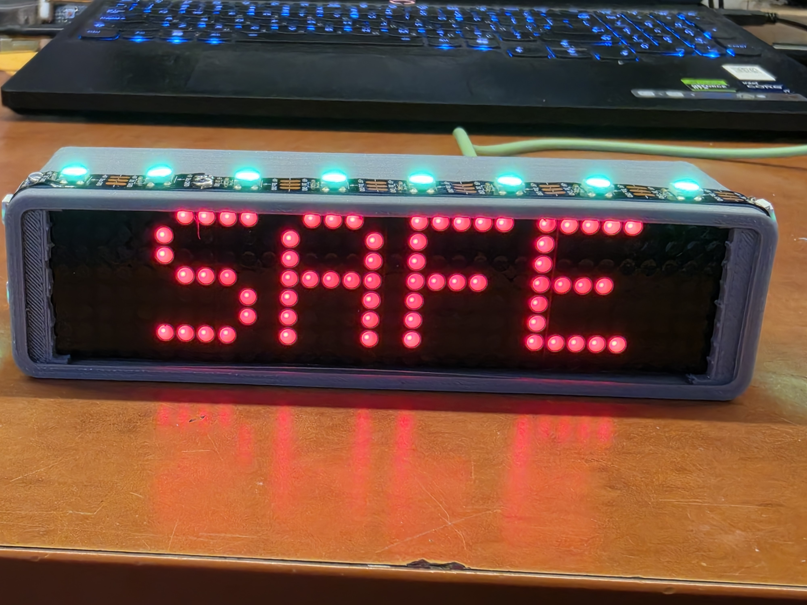
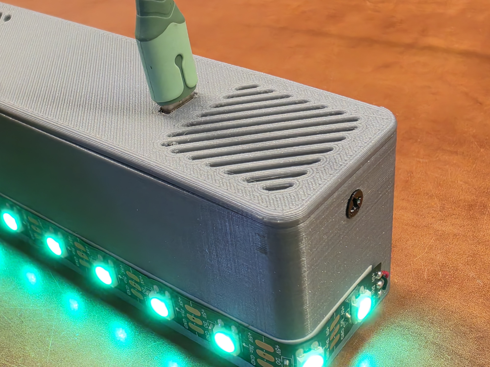
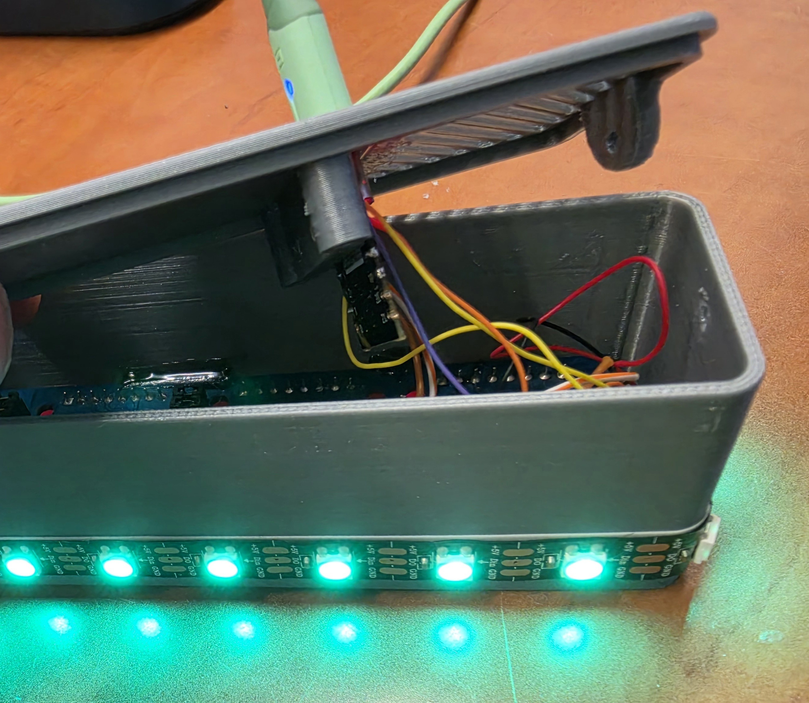

# ESP32-C3 Red Alert Monitor

A standalone ESP32-C3 device that monitors the Israeli Home Front Command (Pikud HaOref) alert API in real time and provides visual feedback via a NeoPixel LED strip and a MAX7219 32×8 dot matrix display — no Home Assistant required.



---

## Features

- Connects to the Pikud HaOref live alert API every 3 seconds
- Filters alerts by city name (configurable via captive portal)
- NeoPixel LED strip changes color based on alert state
- MAX7219 32×8 matrix displays status text
- Captive Portal (WiFiManager) for easy WiFi setup and city configuration — no code changes needed
- City name persisted in flash (survives restarts)

---

## Alert States

| State | LED Color | Matrix Display |
|-------|-----------|----------------|
| Safe | Green (solid) | `SAFE` |
| Pre-Alarm | Orange (solid) | `PRE ALARM` (scrolling) |
| Unsafe | Red (blinking) | `UNSAFE` (scrolling) |

---

## Photos

### Assembled Device — SAFE State

*MAX7219 matrix displaying "SAFE" with NeoPixel LEDs above*

### Enclosure

*3D printed case with NeoPixel strip along the bottom edge*

### Internals

*Wiring inside the enclosure — ESP32-C3, NeoPixel strip, and power connections*

---

## Hardware

- **ESP32-C3 SuperMini** (or compatible)
- **WS2812B NeoPixel** LED strip (12 LEDs)
- **MAX7219 32×8** dot matrix display (4× 8×8 modules)
- 3D printed enclosure

---

## Wiring

### MAX7219 32×8 Matrix

| MAX7219 Pin | ESP32-C3 GPIO |
|-------------|---------------|
| VCC         | 5V (USB)      |
| GND         | GND           |
| DIN         | GPIO7         |
| CLK         | GPIO6         |
| CS          | GPIO5         |

### NeoPixel WS2812B

| WS2812B Pin | ESP32-C3 GPIO |
|-------------|---------------|
| VCC (+5V)   | 5V (USB)      |
| GND         | GND           |
| DIN         | GPIO2         |

> **Note:** The ESP32-C3 outputs 3.3V logic. MAX7219 at 5V expects a minimum 3.5V high signal — in practice this works, but a level shifter on DIN/CLK/CS can improve reliability.

---

## First-Time Setup

1. Power on the device — LED turns **blue**
2. If no WiFi is saved, an access point named **`RedAlert-Setup`** is created
3. Connect from any phone or computer
4. The captive portal opens automatically — select your WiFi and enter your city name in Hebrew (e.g. `רמת השרון`)
5. Save — the device connects and begins monitoring

To reconfigure: erase flash, then repeat the steps above.

---

## Configuration

All settings are stored in flash and survive power cycles.

| Parameter | Default | Where to change |
|-----------|---------|-----------------|
| City name | `רמת השרון` | Captive Portal |
| LED count | 12 | `NEOPIXEL_COUNT` in `main.cpp` |
| LED brightness | 200 (0–255) | `pixel.setBrightness()` in `main.cpp` |
| Matrix brightness | 5 (0–15) | `matrix.setIntensity()` in `main.cpp` |
| Poll interval | 3000 ms | `CHECK_INTERVAL` in `main.cpp` |

---

## Building & Flashing

This project uses [PlatformIO](https://platformio.org/).

```bash
# Clone the repo
git clone https://github.com/amir684/esp32c3-red-alert.git
cd esp32c3-red-alert

# Build and upload
pio run --target upload

# Monitor serial output
pio device monitor
```

---

## Dependencies

| Library | Author |
|---------|--------|
| [WiFiManager](https://github.com/tzapu/WiFiManager) | tzapu |
| [Adafruit NeoPixel](https://github.com/adafruit/Adafruit_NeoPixel) | Adafruit |
| [MD_Parola](https://github.com/MajicDesigns/MD_Parola) | MajicDesigns |
| [MD_MAX72XX](https://github.com/MajicDesigns/MD_MAX72XX) | MajicDesigns |
| [ArduinoJson](https://github.com/bblanchon/ArduinoJson) | Benoît Blanchon |

---

## Alert API Credit

Live alert data is provided by the **Israeli Home Front Command (Pikud HaOref)**:

- API Endpoint: `https://www.oref.org.il/warningMessages/alert/Alerts.json`
- For a full Home Assistant integration using the same API, see [amitfin/oref_alert](https://github.com/amitfin/oref_alert)

---

## License

MIT
